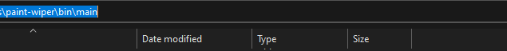
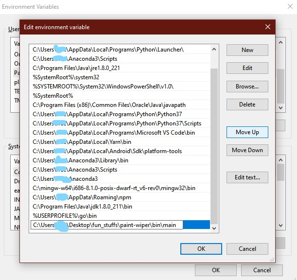

# 🎨 PAINT WIPER

## Intoduction
Paint wiper is a CLI tool for cleaning files affected with the famous windows OS virus known as paint.exe.

<b>Note</b> 
>This tool only works with windows os since paint.exe is mostly used on it, the are some caveat to know about when using it, we will discuss more on it later.

## Installation
First clone this repo using `git clone https://github.com/Fredpwol/Paint-Wiper.git` or you can just download the zip file and extract it on your pc.
Next we add the script location to enviroment path. refer to this [article](https://www.architectryan.com/2018/08/31/how-to-change-environment-variables-on-windows-10/) to learn more on how to get to the enviroment variable on windows.
Once you've Navigated to the path section of the enviroment variables, copy the main path inside the bin folder like so.

create a new path variable and paste the copied path in it, then press ok to save it.

And that's all your all setup, just remember not the change the folder location after this setup. If not repeat this step again.

## Usage
To use it open a command line, the are two options you have naviagte to the folder you want to scan then type in `> paint-wiper` on the terminal or simply type `> paint-wiper FOLDER_PATH` to save time on naviagtion. and thats all your files will be found and those corrupted will be fixed.

## Caveat
So the are some few things you need to know before using this tool.

- To access a folder that needs administrative privilages to modify files you need to open command prompt in administrative mode.
- if the virus file have been deleted before scan the original file will be restored with a `v` prefix before the filename e.g jam.exe will be vjam.exe.
- The folder path that is passed most be absolute and not relative.

###### This is an independent project and has nothing to do with Microsoft Windows or WinRaR, any instance of this software used is for demo purpose only.
